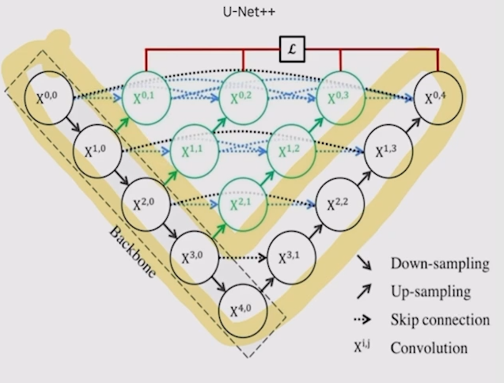

# 05/02

### 할 일

* 6강 High Performance를 자랑하는 Unet 계열의 모델들


### 피어세션

* mosaic augmentation 사용법.

```python
train_pipeline = [
    # dict(type='LoadImageFromFile'),
    # dict(type='LoadAnnotations'),
    dict(
        type='RandomMosaic',
        prob = 0.5,
        img_scale = (512,512),
        pad_val=114),
    dict(type='Resize', img_scale=(512, 512), ratio_range=(0.5, 2.0)),
    dict(type='RandomCrop', crop_size=crop_size, cat_max_ratio=0.75),
    dict(type='RandomFlip', prob=0.5),
    dict(type='PhotoMetricDistortion'),
    dict(type='Normalize', **img_norm_cfg),
    dict(type='Pad', size=crop_size, pad_val=0, seg_pad_val=255),
    dict(type='DefaultFormatBundle'),
    dict(type='Collect', keys=['img', 'gt_semantic_seg']),
]
```

```python
dataset = dict(
            type=dataset_type,
            classes=classes,
            palette=palette,
            reduce_zero_label=False, 
            img_dir=data_root + "images/train",
            ann_dir=data_root + "annotations/train",
            pipeline=[dict(type='LoadImageFromFile'),
                      dict(type='LoadAnnotations')
            ],
        ),
```


### 공부한 내용

#### High Performance를 자랑하는 Unet 계열의 모델들

##### U-net

* 의료 계열에서의 문제 상황
  * 데이터를 구하기 어려워 학습 데이터가 부족.
  * segmentation의 경계가 뚜렷하지 않음.


###### 구조

* contracting path 
  * 특징 추출.
* expanding path
  * up-sampling
  * feature map 결합.


* concat 시 feature map의 크기가 맞지 않는 현상 → crop하여 크기를 맞춤.
* encoder에서 채널 수를 1024까지 증가시켜 좀 더 고차원에서 정보를 맵핑.
* 이전 레이어의 정보를 효율적으로 활용.


###### Technique

* Augmentation
  * Random Elastic deformation
  
* pixel-wise loss weight 계산

  

  * cell의 중심부일수록 인접한 다른 cell과의 거리가 멀기 때문에 작은 weight.
  * 경계를 잘 구분하기 위함.


###### 한계점

* 깊이가 4로 고정 - 데이터셋마다 최적의 깊이를 탐색할 필요가 있음.
* 단순한 skip connection
  * 같은 깊이를 가지는 encoder, decoder만 연결되는 제한적 구조.


##### U-Net++

* encoder를 공유하는 **다양한 깊이의 u-net** 생성.

  

* Dense skip connection

  

  * 같은 레벨의 모든 값을 concat.

* Hybrid Loss = pixel wise cross entropy + soft dice coefficient

  

* deep supervision

  

  * depth가 다른 각 u-net의 loss를 평균해서 사용.


* 장점
  * depth가 다른 여러 u-net을 ensemble한 효과.
  * 단순 ensemble보다 효과가 좋음.
* 한계점
  * 복잡한 connection으로 parameter와 memory 사용이 증가.
  * 동일한 크기를 갖는 feature map만 connection. - full scale에서 충분한 정보를 탐색하지 못함.


##### U-net 3+

* full-scale skip connection

  * conventional - 기존의 simple skip connection

  * inter

    

  * intra

    

* decoder의 채널을 320로 통일. - parameter 수를 줄임.

  

* classification-guided module (CGM)

  * 배경 여부를 판단하는 classification task를 추가하여 사용.

  

* 경계 부분을 잘 학습하기 위해 여러가지 loss 결합.


##### U-Net에서 encoder만 변경한 모델

* Residual U-Net
  * residual unit 추가
* Mobile-UNet 
  * backbone이 mobile-net
* Eff-UNet
  * backbone이 efficient-net


