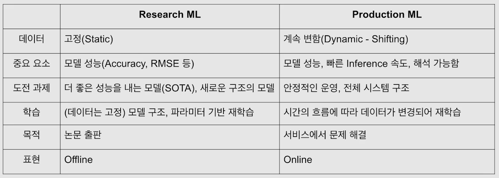
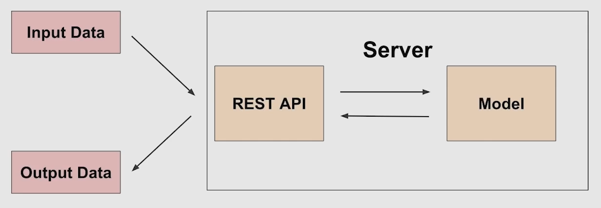
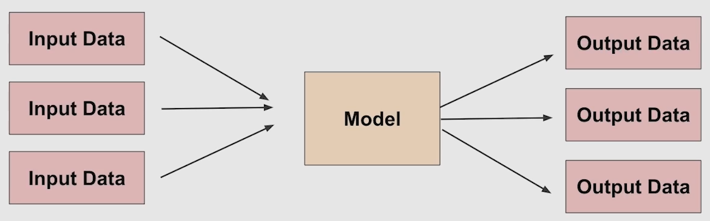

# 05/16

### 할 일

* 1-2강 MLOps 개론
* 1-3강 Model Serving

### 피어세션

* label -1은 무엇인가.
* 항목별로 따로 학습.
  * 적절한 augmentation이 다를 수 있다.

* 부위별로 나누어 평가해야 하는가?
  * 나눈다면 어떻게 나눌 것인가?

* 부위별로 나누어 담당, 항목별, 점수별 이미지 정리해보기.
* timm을 사용하는 방향으로.

### 공부한 내용

#### MLOps 개론

* research 프로세스
  * 문제 정의 - EDA - Feature engineering - Train - Predict
* production 프로세스
  * 문제 정의 - EDA - Feature engineering - Train - Predict - **Deploy**

* 실제 서비스 환경에서는 outlier를 제외하기 힘들다.
* research 환경과 production 환경에서 모델의 성능이 다를 수 있음.

###### MLOps란?

* 머신러닝 모델을 운영하면서 반복적으로 필요한 업무를 자동화시키는 과정.
* 머신러닝 엔지니어링 + 데이터 엔지니어링 + 클라우드 + 인프라
* 모델링에 집중할 수 있도록 관련 인프라를 만들고, 자동으로 운영되도록 만든다.

###### Research와 Production

###### Infra

* 클라우드 : AWS, GCP, Azure, NCP 등.
* 온 프레미스 : 회사나 대학원 전산실에 서버를 직접 설치.

* 대표 라이브러리 : MLflow

---

####  Model Serving

###### Serving

* production 환경에서 모델을 사용할 수 있도록 배포.

* Online Serving
* Batch Serving

###### API (Application Programming Interface)

* 운영체제나 프로그래밍 언어가 제공하는 기능을 제어할 수 있게 만든 인터페이스.

###### Online Serving

* 전처리 서버와 모델 서버를 나눌 수도 있다.
* 서비스 서버와 ML 서버를 별도로 운영할 수도 있다.

* 방법
  * 직접 API 웹 서버 개발
    * Flask, FastAPI 등
  * 클라우드 서비스 활용
    * 다양한 부분을 직접 구축하지 않아도 됨.
    * 사용자 관점에서는 학습 코드만 제공하면 API 서버가 만들어짐.
    * 익숙해야 잘 사용할 수 있음.
    * 비용이 든다.
  * serving 라이브러리 활용

* 재현 가능한 코드.
* latency 최소화.
* 결과에 대한 보정이 필요할 수도 있음을 고려.

###### Batch Serving

* 특정 시간 단위로 실행.
* online serving 보다 구현이 간단함.
* latency에 대한 제약이 적음.
* cold start 
  * 실시간으로 활용할 수 없음.
  * 오늘 새로 생긴 컨텐츠는 추천할 수 없다.