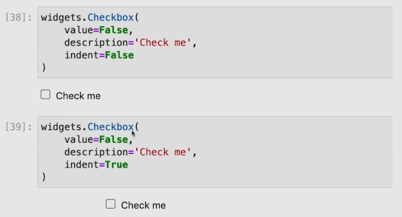
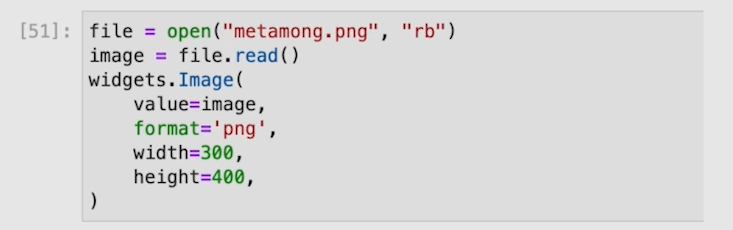
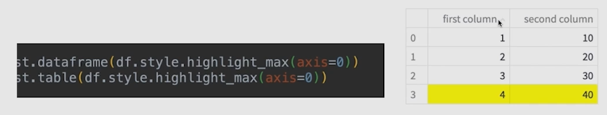
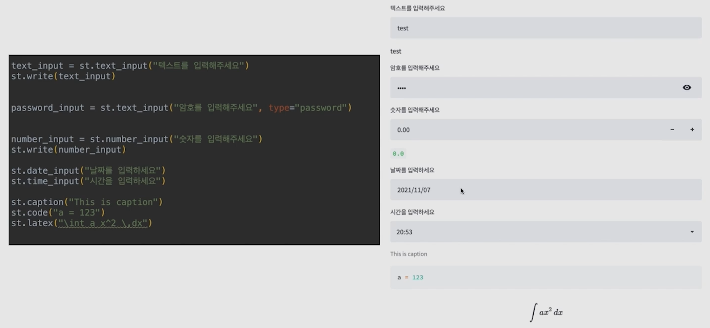
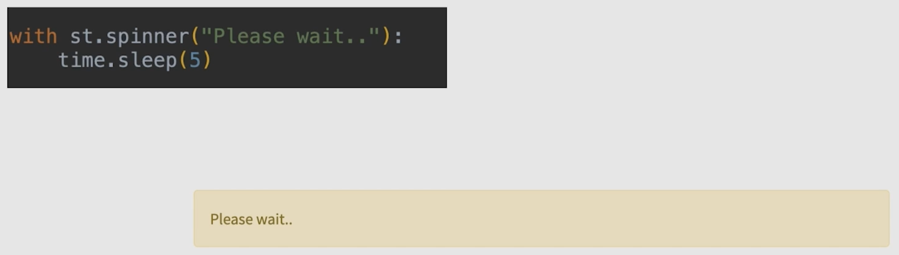
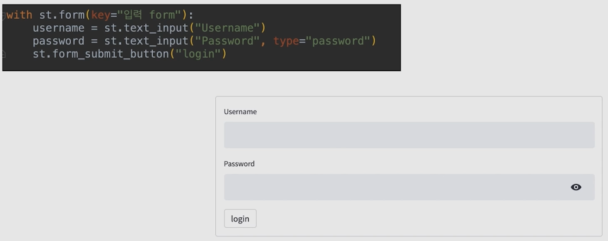

# 05/17

### 할 일

* 2-1강 프로토타이핑 - Notebook 베이스(Voila)
* 2-2강 프로토타이핑 - 웹 서비스 형태(Streamlit)


### 피어세션

* 


### 공부한 내용

#### 프로토타이핑 - Notebook 베이스(Voila)

##### Voila

> https://github.com/voila-dashboards/voila

* 편의를 위해 jupyter notebook을 띄워 만들 수 있는 프로토타입 필요.
* 대시보드를 만들기 위한 목적.
* R의 Shiny, 파이썬의 Dash와 유사한 도구.


* 설치

```bash
$ pip install voila
```

* CLI에서 사용

```bash
$ voila
```


##### ipywidget

* 다양한 위젯 제공.

```python
import ipywidget as widgets
from IPython.display import display
```


###### Slider

```python
# 정수형
sl = widgets.IntSlider(
	value=기본값,
	min=,
	max=,
	step=,
	orientation=,
	description=
)
display(sl)
```

​	

* 그 외

​		

* 값 가져오기

  ```python
  sl.value
  ```

  

###### Text Widget


###### Boolean Widget




* indent : 들여쓰기 여부


###### Selection Widget


###### Upload Widget


###### Image Widget




###### Date Picker Widget


###### Widget Event


###### Interact Decorator

* `@interact` 를 사용하면 자동으로 UI 생성.


* 인자 중 일부를 고정값으로 사용하고 싶을 때


###### Layout

* `VBox` : 수직
* `HBox` : 수평


---


#### 프로토타이핑 - 웹 서비스 형태(Streamlit)


##### Streamlit


> streamlit components : https://docs.streamlit.io/library/api-reference
>
> charts : 


###### Text


###### Button


###### Checkbox


###### Dataframe


* max값 강조




###### metric, JSON


###### Line Chart


###### Map Chart


###### Radio Button, Select Box


* multi select


###### Slider


###### Input Box, Caption, Code, Latex




###### Sidebar

* `st.sidebar`를 하면, sidebar에 요소 추가.

  ex) `st.sidebar.button("hello")`


###### Columns


###### Expander


###### Spinner




###### Ballons

* `st.ballons()`


###### Status Box


###### Form




###### File Upload


###### Session state

* streamlit은 매번 코드가 재실행.
* reset 하고 싶지 않은 변수는 `session_state`로 표현.


###### Cache

* 매번 재실행하는 특성 때문에, 파일도 매번 새로 읽어옴.
* 캐시에 저장할 수 있도록 `@st.cache` 선언.

예시)

