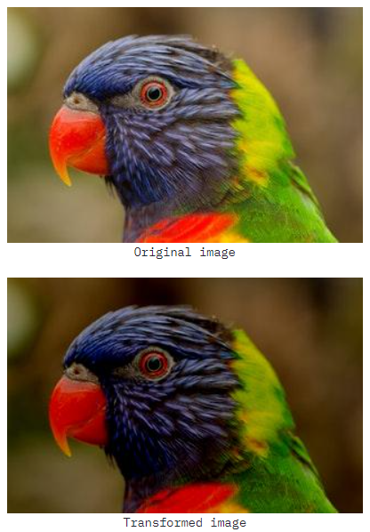
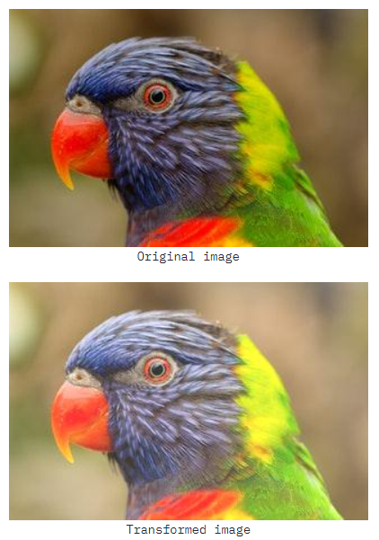
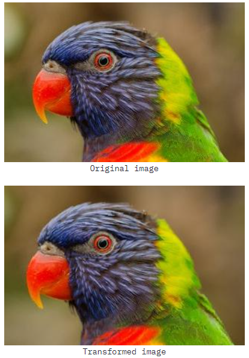
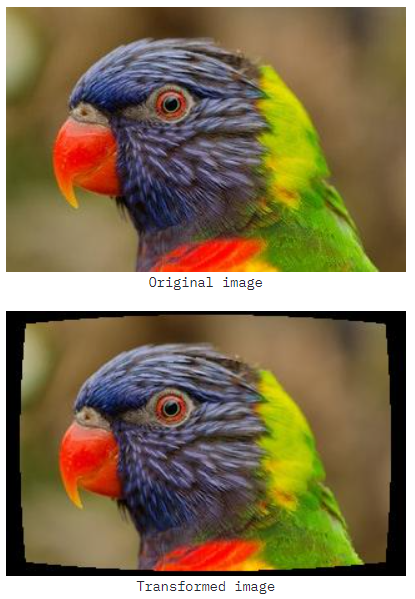
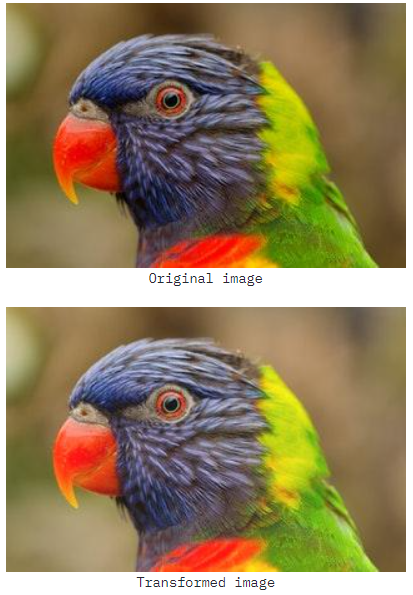
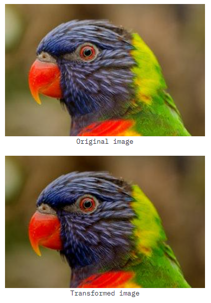

# 05/19

### 할 일

* 모델 학습
* augmentation 조사.
* confusion matrix 그리는 법.

### 피어세션

##### 질문 내용

* 평가 기준?
* 서빙 방식, 바로 찍을 수 있도록? 사진 업로드?
* 프로토타입 성능
* 

### 공부한 내용

###### To Tensor

* torchvision transforms 에서는 Normalize 이전에 ToTensor를 사용할 것.
* albumentations 에서는 Normalize 이후에 ToTensorV2를 사용할 것. (normalize 전에 0~1 스케일링 해주기.)

###### torch.load_state_dict()의 strict=False

* checkpoint 파일과 불러온 모델의 **key 값이 다를 경우**.
* 같은 모델이면 `strict=False`를 통해 자동 적용.
* 주로 다른 곳에서 checkpoint 파일을 가져오거나 한 경우 발생할 수 있다.

##### Augmentation 조사

> https://albumentations-demo.herokuapp.com/

* RandomBrightness

  * 조명 환경이 다른 경우를 고려.

  * limit = -0.2

    

  * limit = 0.2

    

* OpticalDistortion

  * 스마트폰 등으로 촬영 시, 촬영 기기에 따라 렌즈의 굴곡 등이 다를 수 있음.

  * distort list = -0.3

    

  * distort limit = 0.3

    

* ISONoise

  * 일반적으로 스마트폰 카메라를 사용할 것이므로, 센서 노이즈 고려.

  * color shift = 0.1, intensity = 0.3

    

* RGBShift

  * 피부 톤 차이 고려.

  * RGB +20

    

  * RGB -20

    

##### 모델 조사

* EfficientNet v2

  

* 

##### pytorch grad cam 라이브러리

>  https://github.com/jacobgil/pytorch-grad-cam