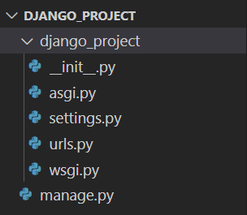
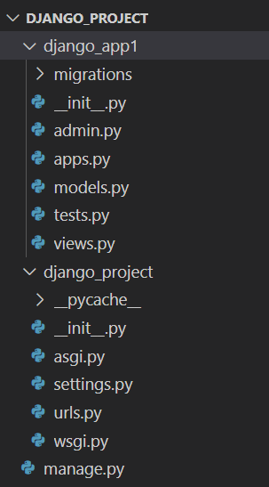
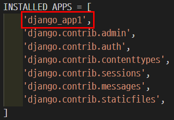
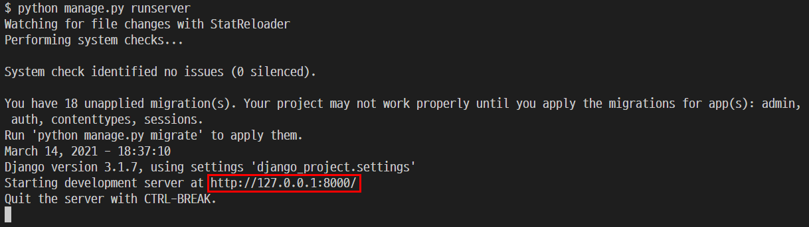
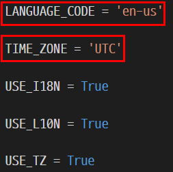

* pip install 필요.

```bash
$ pip install django
```


## 기본 명령어

### 프로젝트 생성

```bash
$ django-admin startproject (프로젝트 명)
```

* 프로젝트 폴더가 생성 된다.



* 프로젝트 생성 직후.


### Application 추가

```bash
$ python manage.py startapp (app 명)
```

* 새로운 application의 폴더가 생성된다.



* application 생성 직후.

* application 이름은 항상 **복수형 단어**를 선택하자.
* app 생성 후에는 `settings.py`의 `INSTALLED_APPS`에 '(application 명)' 을 추가해야함.




### 서버 실행

```bash
$ python manage.py runserver
```

* 서버를 실행해야 작성한 프로젝트가 동작하는 지를 확인할 수 있다.



* 서버 주소. `ctrl + click` 하면 창이 뜬다.


* 서버 종료 : `ctrl + c`


## 시스템 언어와 시간 바꾸기

* `settings.py` 맨 아래.



* `LANGUAGE_CODE` : 시스템 언어. (한국어 : `ko-kr`)
* `TIME_ZONE` : 시스템 시간. (한국 시간 : `Asia/Seoul`)
* `USE_TZ` : `TIME_ZONE` 설정의 활성화 여부. 활성하지 않을 시, 기존 값 (UTC)이 적용.