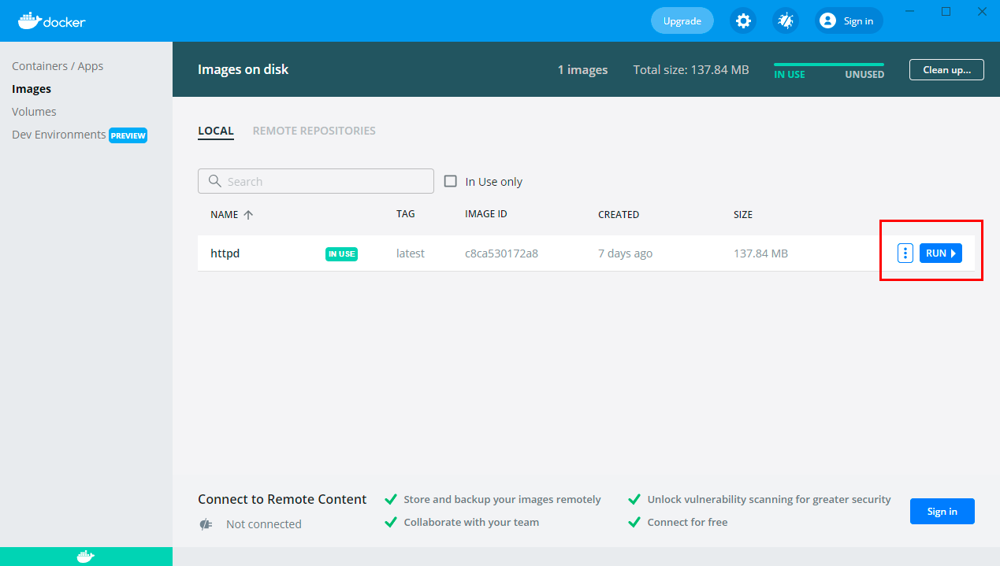
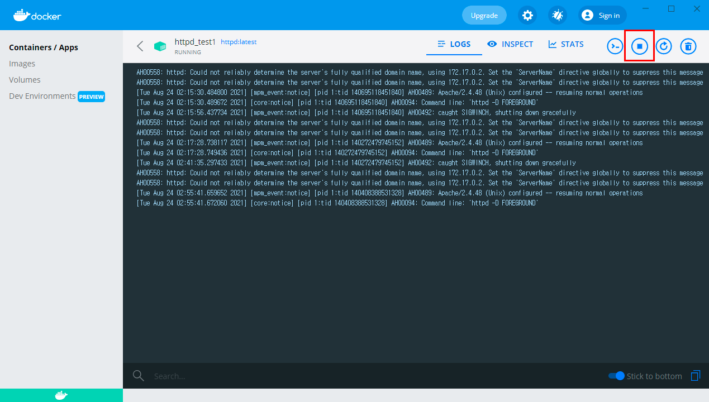
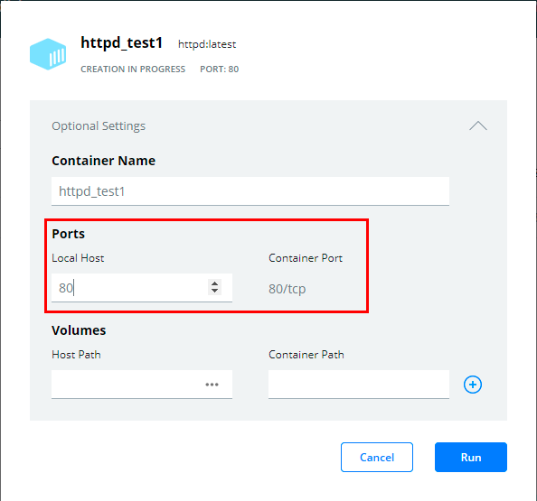
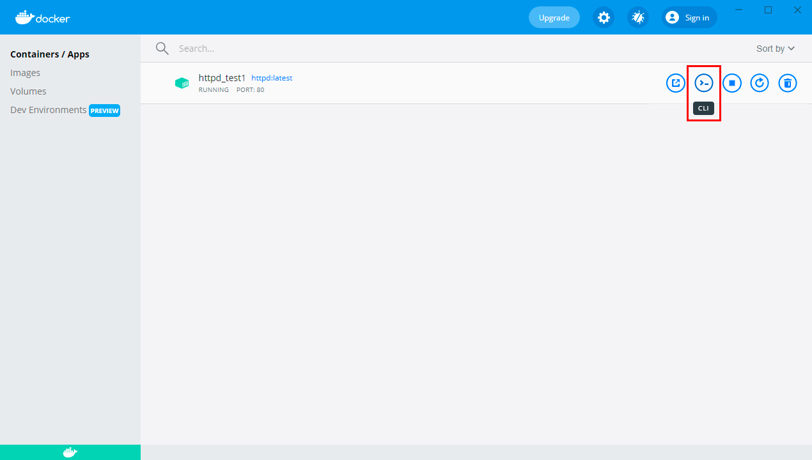

# Docker 시작하기

> 생활코딩 docker 입문수업.
>
> https://www.youtube.com/watch?v=Ps8HDIAyPD0&list=PLuHgQVnccGMDeMJsGq2O-55Ymtx0IdKWf


## 1. Docker 설치

* https://docs.docker.com/get-docker/


## 2. Image

* docker의 `image`는 `program`에 대응되는 개념.


### 2.1. Image 검색

* https://hub.docker.com/search?q=&type=image

* 여기서 official image라고 적힌 것이 docker에서 직접 관리해주는 image.


### 2.2. Image pull

```bash
$ docker pull [options] (image_name)
```

* https://docs.docker.com/engine/reference/commandline/pull/


### 2.3. Image 확인하기

* 저장된 image들의 목록 확인.

```bash
$ docker images
```


### 2.4. Image 삭제

``` bash
$ docker rmi (image_name)
```

* https://docs.docker.com/engine/reference/commandline/rmi/


## 3. Container

* docker의 `container`는 `process`에 대응되는 개념.


### 3.1. Dashboard

#### 3.1.1. run




#### 3.1.2. stop



* container의 로그도 조회 가능.


### 3.2. Command

#### 3.2.1. run

```bash
$ docker run [options] (image_name)
```

* https://docs.docker.com/engine/reference/commandline/run/
* container 이름을 직접 지정하기

```bash
$ docker run --name (container_name) (image_name)
```

* 하나의 image로 여러 개의 container 생성 가능.


#### 3.2.2. stop

```bash
$ docker stop (container_name or container_id)
```

* https://docs.docker.com/engine/reference/commandline/stop/


#### 3.2.3. log 확인

```bash
$ docker logs [options] (container_name)
```

* https://docs.docker.com/engine/reference/commandline/logs/


```bash
$ docker logs -f (container_name)
```

* `-f` : 실시간으로 계속 log를 출력.


#### 3.2.4. remove

```bash
$ docker rm [options] (container_name)
```

* https://docs.docker.com/engine/reference/commandline/rm/
* 옵션을 사용하지 않으면, 실행 중인 container는 삭제할 수 없다.


```
$ docker rm --force (container_name)
```


### 3.3. Container 확인

```bash
$ docker ps [options]
```

* https://docs.docker.com/engine/reference/commandline/ps/
* 옵션이 없으면 실행 중인 container만 출력.


```bash
$ docker ps -a
```

* `-a` : stop된 container도 모두 출력.


## 4. 네트워크

* `host` : container가 설치된 운영체제.
* 호스트와 컨테이너는 독립적으로 파일 시스템과 포트를 가지고 있다.
* 호스트와 컨테이너의 포트를 연결해주어야 함. - `port forwarding`

```bash
$ docker run -p (local host port):(container port) (image_name)
```

* dashboard에서 container 생성 시.



* `docker run --name httpd_test1 -p 80:80 httpd`

* 접속 테스트 : `localhost:80/index.html`


## 5. 명령어 실행

## 5.1. Container 내부에서 명령 실행

### 5.1.1. Dashboard에서




### 5.1.2. CMD에서

```bash
$ docker exec (container name) (실행할 command)
```

* https://docs.docker.com/engine/reference/commandline/exec/
* 명령어를 하나씩만 실행.
* 하나 실행할 때마다 exec를 사용해야함.


```bash
$ docker exec -it (container name) /bin/sh
```

* shell에서 실행.
* `/bin/bash`로 하면 bash shell 실행.


#### *nano editor

* 설치

```bash
$ apt update
$ apt install nano
```

* 사용

```bash
$ nano (file name)
```


## 6. 파일시스템 연결

* host와 container의 파일 시스템을 연결.
* 컨테이너 삭제 시에는 컨테이너에 담겨있던 내용들이 모두 사라짐.
* 컨테이너의 파일 시스템을 호스트와 연결하여 안전하게 관리.
* **실행은 컨테이너**에서, **작업은 호스트**에서.


* `docker run`의 `-v` 옵션:  `(host directory):(container directory)`

```bash
$ docker run -p 80:80 -v ~/Desktop/test:/usr/local/apache2/htdocs/ httpd
```

