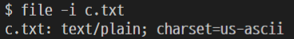
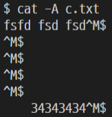

# 리눅스 기본 명령어

> 리눅스 마스터 2급 1차 시험 공부용.
>
> 참조 : 2021 이기적 리눅스마스터 2급


#### `which`

* 명령어의 **위치**를 찾아줌.

```bash
$ which (명령어)
```


#### `alias`

* 자주 사용하는 명령어의 별칭을 설정.

```bash
$ alias (별칭)='(명령어)'
```

* 예시 : `$ alias m='ls -al | more'`
* 명령어 `ls -al | more` 를 `m`으로 대체.


#### `unalias`

```bash
$ unalias [옵션] (별칭)
```

| 옵션 |          설명           |
| :--: | :---------------------: |
| `-a` | 설정된 모든 alias 해제. |


#### `PATH`

* 실행 파일들의 디렉토리 위치를 저장한 환경 변수.
* 지정된 PATH값 확인.

```bash
$ echo $PATH
```

* 여러 경로들이 `:`으로 구분.
* 새로운 경로 추가.

```bash
$ export PATH=$PATH: (경로)
```


#### `man`

* 명령어의 **매뉴얼** 제공.

```bash
$ man [섹션] [옵션] (명령어)
```


---


## 사용자 생성 명령어

#### `useradd`

* 계정 생성.

```bash
$ useradd [옵션] (계정명)
```

|    옵션     |                           설명                           |
| :---------: | :------------------------------------------------------: |
|    `-s`     |                   로그인 기본 셸 지정.                   |
| `-d (경로)` |                    홈 디렉토리 지정.                     |
| `-f (기간)` |     패스워드 만기 ~ 계정 영구 말소까지의 기간 지정.      |
| `-e (기간)` | 유효기간 지정. 특정 기간만 사용하는 임시 계졍을 만들 때. |
|    `-c`     |         `/etc/passwd`에 새로운 사용자 설명 추가.         |
|    `-G`     |                  다른 그룹에 계정 추가.                  |

* 기본 홈 디렉토리 : `/home/(계정명)`


#### `passwd`

* 패스워드 입력 및 변경.
* 패스워드는 `/etc/shadow`에 기록.


#### `su`

* switch user
* 다른 사용자 계정으로 로그인.


---


## 사용자 계정 관리

#### `usermod`


#### `userdel`


#### `chage`

* 패스워드의 만료 정보 변경.


---


## 그룹 관리

#### `groupadd`


#### `groupdel`


#### `groupmod`


---


## 사용자 조회 명령어

#### `users`

* 로그인한 사용자 정보 출력.


#### `who`

* 현재 시스템에 접속한 사용자 조회.


#### `w`

* 현재 접속 중인 사용자들 정보.


#### `id`

* 사용자(현재 사용 중인 계정, 본인)의 **uid, gid, group**을 확인.


#### `groups`

* 사용자가 속한 **그룹 목록** 확인.


---


## 디렉토리 관리 명령어

#### `pwd`

* 현재 작업 중인 디렉토리 경로 출력.


#### `cd`

* change directory, 디렉토리 이동.
* 절대경로, 상대경로 모두 사용 가능.

```bash
$ cd (경로)
```

| 설정 경로 |         설명          |
| :-------: | :-------------------: |
|    `~`    |      홈 디렉토리      |
|    `.`    |     현재 디렉토리     |
|   `..`    | 한 단계 상위 디렉토리 |
|    `/`    |     루트 디렉토리     |


#### `mkdir`

* make directory, 새로운 디렉토리 생성.

```bash
$ mkdir [옵션] (디렉토리명)
```

| 옵션 |               설명               |
| :--: | :------------------------------: |
| `-m` |     권한 설정 (디폴트 : 755)     |
| `-p` |          상위 경로 생성          |
| `-v` | 생성된 디렉토리의 메세지 출력(?) |


#### `rmdir`

* remove directory, 디렉토리**만** 삭제.
* 해당 디렉토리 안에 파일이 존재하면 삭제되지 않음.

```bash
$ rmdir (디렉토리명)
```


---


## 파일 관련 명령어

#### `ls` ※ 중요

* 현재 작업 중인 곳에 있는 파일과 디렉토리 목록 출력.

```bash
$ ls [옵션] [경로명]
```

| 옵션 |                           설명                           |
| :--: | :------------------------------------------------------: |
| `-a` |                   히든 파일 포함 (all)                   |
| `-l` |    자세한 정보 함께 표시 (퍼미션, 용량, 생성일시 등)     |
| `-d` |               지정된 디렉토리의 정보 출력                |
| `-r` |              알파벳 역순으로 출력 (reverse)              |
| `-R` | 바로 아래 하위 경로와 그 안에 있는 파일 및 디렉토리 표시 |


#### `cp`

* copy, 파일 또는 디렉토리 복사.

```bash
$ cp [옵션] (대상 파일 및 디렉토리명)
```

| 옵션 |                             설명                             |
| :--: | :----------------------------------------------------------: |
| `-b` |        복사 대상이 이미 존재하면, **백업 파일** 생성         |
| `-f` |          복사 대상이 이미 존재하면, **지우고** 복사          |
| `-i` | 복사 대상이 이미 존재하면, 덮어 씌울 것인지 **사용자에게 확인 (대화형)** |
| `-r` |         **하위에 있는** 디렉토리와 파일을 모두 복사          |


#### `rm`

* remove, 파일 또는 디렉토리 삭제.

```bash
$ rm [옵션] (파일 또는 디렉토리명)
```

| 옵션 |                 설명                  |
| :--: | :-----------------------------------: |
| `-f` |            **강제**로 삭제            |
| `-i` |    삭제 여부를 **사용자에게 확인**    |
| `-r` | **하위의 모든** 파일 및 디렉토리 삭제 |


#### `mv`

* move
* 파일 또는 디렉토리 **이동**.
* 파일 또는 디렉토리 **이름 변경**.

```bash
$ mv [옵션] (원본) (변경 대상)
```

| 옵션 |                             설명                             |
| :--: | :----------------------------------------------------------: |
| `-b` |             대상이 이미 있을 경우, **백업 생성**             |
| `-f` | 대상이 이미 있을 경우에도 사용자에게 확인하지 않고 **강제로** 변경 |
| `-v` |                   변경 과정을 자세히 표시                    |


#### `touch`

* 빈 파일 생성.
* 타임 스탬프 : 파일의 시간 정보.
  * 접근시간 (access time) : 파일을 읽을 때마다 갱신.
  * 수정시간 (modify time) : 파일 내용이 변경 될 때 갱신.
  * 변경시간 (change time) : 파일 내용을 수정했을 때. **사용자가 임의로 변경 불가능.**

```bash
$ touch [옵션] (파일명)
```

|         옵션         |                     설명                     |
| :------------------: | :------------------------------------------: |
|         `-a`         |                접근시간 변경                 |
|         `-m`         |                수정시간 변경                 |
|         `-c`         | 시스템의 현재 시간으로 파일의 시간 정보 수정 |
|   `-t (시간정보)`    |          특정 파일의 시간 정보 변경          |
| `-r (파일1) (파일2)` |       파일1의 시간 정보를 파일2에 적용       |


#### `file`

* 파일의 **종류 및 속성값** 출력.

```bash
$ file [옵션] (파일명)
```

| 옵션 |                  설명                   |
| :--: | :-------------------------------------: |
| `-b` |    파일 유형만 표시 (파일명 출력 X)     |
| `-f` | 파일 목록에서 지정한 파일에 대해서만(?) |
| `-z` |       압축 파일의 내용 출력 (.gz)       |
| `-i` |           MIME 타입으로 출력            |

* MIME 타입 

  


#### `find`

* 주어진 조건의 파일을 찾아 **경로 출력**.
* 경로를 따로 설정하지 않으면, 현재 디렉토리를 기준으로 모든 하위 디렉토리를 탐색.

```bash
$ find [경로] [옵션] [검색내용]
```

|     옵션     |                설명                |
| :----------: | :--------------------------------: |
|   `-name`    |             이름 검색              |
|   `-user`    |  사용자의 파일이나 디렉토리 검색   |
|   `-perm`    |        지정된 권한으로 검색        |
|   `-type`    |         파일 유형으로 검색         |
| `-atime (n)` |       n일 이전에 접근한 파일       |
|   `-exec`    | 검색된 파일들에 수행할 명령어 지정 |


#### `locate`

* 파일의 위치 찾기.
* **현재 시스템**에 존재하는 파일들을 모두 탐색.

```bash
$ locate (파일명)
```


---


## 텍스트 파일 관련 명령어

#### `cat`

* 파일 내용 출력.

```bash
$ cat [옵션] (파일)
```

| 옵션 |                  설명                  |
| :--: | :------------------------------------: |
| `-n` | **행번호** 표시 (비어있는 행 **포함**) |
| `-b` | **행번호** 표시 (비어있는 행 **제외**) |
| `-s` | 빈 행이 2줄 이상 연속되면 하나로 출력  |
| `-A` |      개행 문자나 탭 문자를 알려줌      |




#### `head`

* 파일의 **앞부분**을 원하는만큼 출력.
* 기본은 10줄.

```bash
$ head [옵션] (파일)
```

|          옵션          |           설명            |
| :--------------------: | :-----------------------: |
|          `-c`          | 지정한 **용량**만큼 출력  |
| `-n (숫자) or -(숫자)` | 지정한 **행 수**만큼 출력 |


#### `tail`

* 파일의 뒷부분을 원하는만큼 출력.
* 마지막 행을 기준으로 원하는 행 수만큼 출력.
* 기본은 10줄.

```bash
$ tail [옵션] (파일)
```

|          옵션          |                  설명                  |
| :--------------------: | :------------------------------------: |
|          `-c`          |               용량 지정                |
| `-n (숫자) or -(숫자)` |               행 수 지정               |
|          `-f`          | 새롭게 추가되는 내용을 실시간으로 출력 |
|          `-v`          |              파일명 표시               |
|          `-q`          |             파일명 표시 X              |


#### `more`

* 파일 내용을 화면 단위로 끊어서 출력.
* 지나간 내용을 다시 볼 수는 없다.

```bash
$ more [옵션] (파일)
```

| 옵션      | 설명                            |
| --------- | ------------------------------- |
| `-(숫자)` | 한 페이지에 표시되는 행 수 지정 |

| 키          | 설명        |
| ----------- | ----------- |
| `Space Bar` | 다음 페이지 |
| `Enter`     | 한 줄씩     |
| `Ctrl + D`  | 반 페이지   |
| `Ctrl + B`  | 이전 페이지 |
| `Q`         | 종료        |
| `/(패턴)`   | 검색        |

