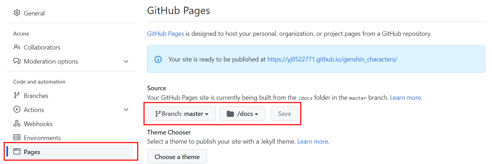

# github io로 배포하기

> references
>
> https://velog.io/@byungjur_96/vue.js-Github-Pages%EB%A1%9C-%EB%B0%B0%ED%8F%AC%ED%95%98%EA%B8%B0


### 1. `vue.config.js` 작성

```js
module.exports = {
    publicPath: '/<repo_name>',
    outputDir: 'docs'
}
```

* outputDir에는 repo 최상위 경로를 기준으로 docs 경로를 적어준다.


### 2. 빌드

```bash
$ npm run build
```

* 위에서 설정한 `outputDir`에 배포에 필요한 html, css, js 등의 파일이 생성됨.


### 3. git에 repo 생성 & 페이지 연결

* repo 생성 후, 코드를 push하고 settings.

