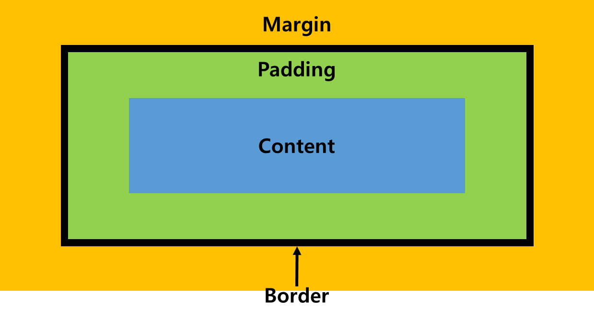

# 2. Web - CSS

> HTML에서 스타일, 레이아웃 등을 지정해주는 언어.
>
> 함께 쓰이지만, HTML과는 엄연히 다른 문법을 가지는 다른 언어이다.
>
> 속성(property) 과 값(value) 으로 한 쌍을 이룬다.


## 적용 방법

* 인라인 (`inline`) 방식 

  * tag에 `style` 속성을 추가하여 선언하는 방식.

  * 재사용성이 떨어지고, 코드가 난잡해진다.

    ```html
    <!-- 사용 방법 -->
    <tag style="property: value;">
    	...
    </tag>
    ```

    

* 내부 참조

  * head에 `style` 태그를 추가하여 선언하는 방식.
  * `style` 태그 내부는 html이 아닌 css 문법을 따른다. (주석 형식도 달라짐.) 
  * 인라인 방식에 비해서는 가독성이 좋고, 재사용성이 높다.
  * 같은 스타일을 다른 html에 적용하기는 번거로워, 외부 참조에 비해서는 재사용성이 떨어진다.

* 외부 참조

  * 따로 저장해놓은 css 파일을 `link` 태그를 이용해 불러온다.
  * `link` 태그는 head에 위치.
  * 재사용성이 높고, html 코드 내부가 깔끔해진다.


## 선택자 (Selector)

### 기초 선택자

#### 전체 선택자

* `*` 로 표현.

* 모든 요소에 대해 적용.

  ```css
  * {
      property: value;
  }
  ```


#### Class 선택자

* 직접 지정한 클래스명에 적용될 스타일을 지정함.

* 클래스명에 `.` 를 붙여 만든다.

  ```css
  /* 스타일 선언 */
  .class-name1 {
      property1: value1;
      property2: value2;
  }
  ```

  ```html
  <!-- 사용 방법 -->
  <tag class="class-name1 class-name2">
  	...
  </tag>
  ```

* 여러 클래스를 하나의 태그에 선언할 경우 **띄어쓰기**로 구분.


#### id 선택자

* 사용 방법은 대부분 클래스 선택자와 동일하며, 아이디에 `#` 를 붙여 사용한다.

  ```css
  /* 스타일 선언 */
  #style-id {
      property1: value1;
      property2: value2;
  }
  ```

  ```html
  <!-- 사용 방법 -->
  <tag id="style-id">
  	...
  </tag>
  ```

* id 선택자는 여러 개를 선언할 수 없다.
* 여러 id를 입력할 경우, 맨 앞의 하나만 인식.


### 결합자 (Combinators)

#### 자손 결합자

* 띄어쓰기(` `) 로 표현.

* 모든 하위 요소에 대해 적용.

  ```css
  /* parent 아래의 모든 child에 대해 적용 */
  parent-tag child-tag {
      property: value;
  }
  ```

 

#### 자식 결합자

* `>` 로 표현.

* 바로 하위의 요소에 대해서만 적용.

  ```css
  /* parent 바로 아래의 child에 대해서만 적용 */
  parent-tag > child-tag {
      property: value;
  }
  ```

  

#### 형제 선택자

* `~` 로 표현.

* 뒤에 오는, 같은 레벨 모든 요소에 대해 적용.

  ```css
  sibling-A ~ sibling-B {
      property: value;
  }
  ```

* A 뒤에 오는 같은 레벨의 모든 B에 대해 적용.


#### 인접 형제 선택자

* `+` 로 표현.

* 바로 뒤에 오는 같은 레벨의 요소에 대해 적용.

  ```css
  sibling-A + sibling-B {
      property: value;
  }
  ```

* A 바로 뒤에 오는 같은 레벨의 B에 대해 적용.
* A와 B 사이에 다른 요소가 있으면 적용되지 않는다.


### 적용 우선 순위

1. `!important`
2. inline style
3. id 선택자
4. class 선택자
5. 요소 선택자
6. 코드 순서


## 단위

### 크기 표현 단위

* `px`

* `%` : 부모 사이즈의 비율.

* `em` : 상속받는 사이즈에서의 배율.

* `rem` : root 사이즈의 배율, 기본 16px.

* viewport

  * `vh`, `vw` : 화면(브라우저) 사이즈 기준, 100을 전체 크기로 둔다.

  * `vmin`, `vmax` : 브라우저 사이즈 중, 작은 or 큰 쪽을 기준.

    

### 색상 표현 단위

* HEX (#000, #000000)
* RGB / RGBA (A는 투명도.)
* 색상명
* HSL (명도, 채도, 색조 등) : 잘 사용 안 함.
* HSLA


## Box Model



1. **Content**
   * 실제 글이나 이미지가 들어가는 부분.
2. **Padding**
   * border 안쪽의 여백. 
   * 배경색 등이 들어감.
3. **Border**
4. **Margin**
   * border 바깥쪽의 여백.
   * 마진 상쇄가 일어남.


### 마진 상쇄

> 위 아래로 인접하는 요소들의 마진이 서로 상쇄됨. 옆으로 인접한 요소끼리는 일어나지 않는다.
>
> 마진이 더 큰 쪽을 따른다.
>
> **ex)**
>
> 위쪽 요소의 마진 : 30px, 아래쪽 요소의 마진 : 50px
>
> ⇒ 두 요소의 border 사이의 간격은 50px


### box-sizing

* CSS 스타일로 box-sizing의 기준을 정할 수 있다.
* 지정한 영역까지의 크기를, 스타일로 선언하는 크기로 정한다. (**ex)** content-box & width 50px : content의 가로 길이가 50px이 된다.)
* 따로 선언하지 않으면 기본은 `content-box` 이다.
* `border-box` 는 border의 두께를 포함한다.


## 상속

* 부모 요소에게서 상속 받는 것 
  * text 관련 요소 (font, color, text-align)
  * opacity
  * visibility
* 상속 받지 않는 것
  * box model 관련 요소 (width, height, margin, padding, border)
  * position 관련


## Display


## References

1. **단위** 

   1.  https://webclub.tistory.com/356
   2.  https://nykim.work/85

   ​		